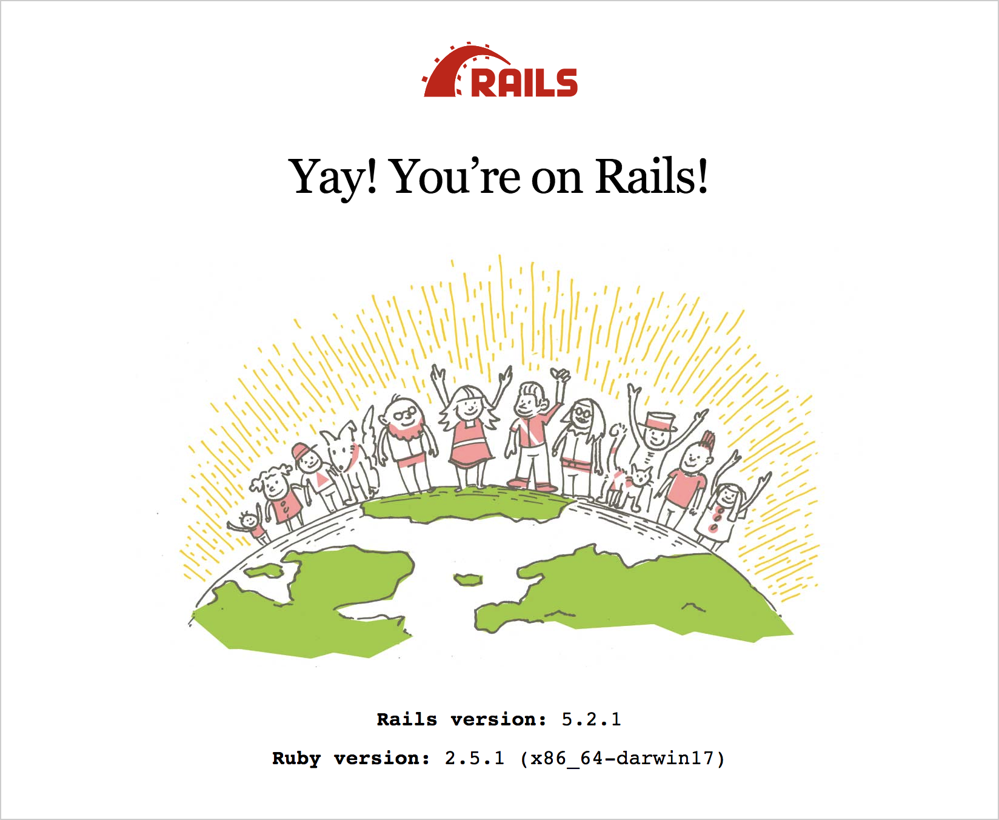
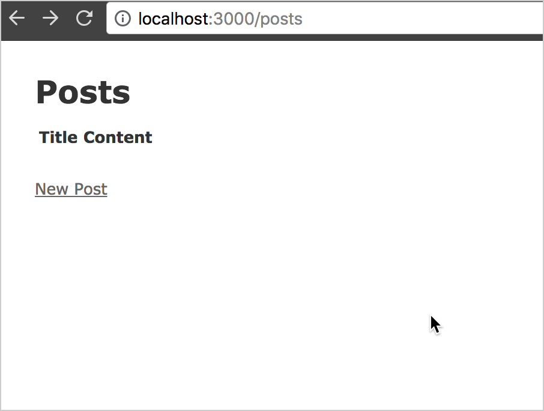

# 도커를 이용한 레일스 5 프로젝트의 배포

: Deployment of Rails 5 Project using Docker


이 글에서는 저자가 최근에 도커를 이용한 레일스 프로젝트의 배포에 관심을 가지고 관련 전자책과 인터넷을 검색하여 공부한 내용을 정리하여 공유하고자 한다. 

한마디로, 도커 컴포저를 이용하여 레일스 애플리케이션, Nginx 웹서버, Postgresql 데이터베이스를 각각의 컨테이너로 연결하여 하나의 웹서비스로 제공하도록 한 것이다. 

참고한 소스는 다음과 같다. 

- [Docker for Rails Developers, Rob Isenberg](https://pragprog.com/book/ridocker/docker-for-rails-developers)
- [Docker + Rails + Puma + Nginx + Postgres](https://itnext.io/docker-rails-puma-nginx-postgres-999cd8866b18)

해결해야할 이슈들

- https://github.com/lautis/uglifier/issues/127
- https://stackoverflow.com/questions/42537225/rails-deploying-with-docker-compose-assets-doesnt-working

소스 

- https://gist.github.com/satendra02/1b335b06bfc5921df486f26bd98e0e89


## (1) 레일스 5 프로젝트의 생성


### 1. 개발환경

- Ruby 2.5.1
- Rails 5.2.1
- Nodejs


### 2. 샘플 프로젝트의 생성

```sh
$ rails new blog -d postgresql && cd blog 
```


### 3. 데이터베이스의 생성

```sh
$ rails db:create
Created database 'blog_development'
Created database 'blog_test'
```


### 4. 프로젝트 확인

로컬 서버를 시작한 후 브라우저에서 http://localhost:3000 으로 연결하여 시작 페이지가 제대로 보이는지 확인한다. 

```sh
$ rails server 
```





### 5. Post 리소스의 Scaffolding

아래와 같이 명령을 실행한다.

```sh
$ rails g scaffold Post title content:text && rails db:migrate
Running via Spring preloader in process 24600
      invoke  active_record
      create    db/migrate/20180816121601_create_posts.rb
      create    app/models/post.rb
      invoke    test_unit
      create      test/models/post_test.rb
      create      test/fixtures/posts.yml
      invoke  resource_route
       route    resources :posts
      invoke  scaffold_controller
      create    app/controllers/posts_controller.rb
      invoke    erb
      create      app/views/posts
      create      app/views/posts/index.html.erb
      create      app/views/posts/edit.html.erb
      create      app/views/posts/show.html.erb
      create      app/views/posts/new.html.erb
      create      app/views/posts/_form.html.erb
      invoke    test_unit
      create      test/controllers/posts_controller_test.rb
      create      test/system/posts_test.rb
      invoke    helper
      create      app/helpers/posts_helper.rb
      invoke      test_unit
      invoke    jbuilder
      create      app/views/posts/index.json.jbuilder
      create      app/views/posts/show.json.jbuilder
      create      app/views/posts/_post.json.jbuilder
      invoke  assets
      invoke    coffee
      create      app/assets/javascripts/posts.coffee
      invoke    scss
      create      app/assets/stylesheets/posts.scss
      invoke  scss
      create    app/assets/stylesheets/scaffolds.scss
== 20180816121601 CreatePosts: migrating ======================================
-- create_table(:posts)
   -> 0.0307s
== 20180816121601 CreatePosts: migrated (0.0308s) =============================
```

그리고 브라우저에서 확인한다.




## (2) Docker Compose 의 생성

https://docs.docker.com/compose/

도커 컴포즈란, 하나의 이상의 도커 애플리케이션을 정의하고 실행하는 툴이다.

즉, 애플리케이션 서버, 웹 서버, 데이터베이스 서버를 각각의 컨테이너로 생성하여 하나의 완전한 웹서비스로 만들어 주는 것이다. 


여기서는 레일스 애플리케이션을 도커 이미지로 만들기 위한 도커파일(DockerFile)가 웹 서버를 도커 이미지로 만들기 위한 도커파일(DockerFile) 각각 생성하고 마지막으로 도커컴포즈 정의파일(docker-compose.yml)을 생성한다. 


### 1. 디렉토리 구조 

https://gist.githubusercontent.com/satendra02/1b335b06bfc5921df486f26bd98e0e89/raw/843586fe576f6142d673a00fc685d2ed1d03de36/readme.txt

```
-blog
  -app
  -db
  -config
    -database.yml
  ...
  -docker
    -app
      -DockerFile
    -web
      -DockerFile
      -nginx.conf
  -docker-compose.yml
```

프로젝트 루트 디렉토리에 **docker** 라는 디렉토리를 생성한 후 이동한다.  

레일스 애플리케이션에 대한 도커 이미지를 생성하기 위한 도커파일을 **app** 디렉토리를 생성하고, 웹 서버에 대한 도커 이미지를 생성하기 위한 도커파일을 **web** 디렉토리에 생성한다. 

```sh
$ mkdir app && touch app/DockerFile
$ mkdir web && touch web/DockerFile
```

각 파일의 내용은 다음과 같다.

### 2. app/DockerFile

```dockerfile
FROM ruby:2.5.1

# Install dependencies
RUN apt-get update -yqq
RUN apt-get install -yqq --no-install-recommends build-essential libpq-dev nodejs

# Set an environment variable where the Rails app is installed to inside of Docker image:
ENV RAILS_ROOT /var/www/blog
RUN mkdir -p $RAILS_ROOT

# Set working directory, where the commands will be ran:
WORKDIR $RAILS_ROOT

# Setting env up
ENV RAILS_ENV='production'
ENV RACK_ENV='production'

# Adding gems
COPY Gemfile* ./
RUN bundle install --jobs 20 --retry 5 --without development test

# Adding project files
COPY . .
RUN bundle exec rake assets:precompile

EXPOSE 3000
CMD ["bundle", "exec", "puma", "-C", "config/puma.rb"]
```

원본소스 : https://gist.githubusercontent.com/satendra02/1b335b06bfc5921df486f26bd98e0e89/raw/843586fe576f6142d673a00fc685d2ed1d03de36/app.DockerFile


### 3. web/DockerFile

```dockerfile
# Base image:
FROM nginx
# Install dependencies
RUN apt-get update -qq && apt-get -y install apache2-utils

# establish where Nginx should look for files
ENV RAILS_ROOT /var/www/blog

# Set our working directory inside the image
WORKDIR $RAILS_ROOT

# create log directory
RUN mkdir log

# copy over static assets
COPY public public/

# Copy Nginx config template
COPY docker/web/nginx.conf /tmp/docker.nginx

# substitute variable references in the Nginx config template for real values from the environment
# put the final config in its place
RUN envsubst '$RAILS_ROOT' < /tmp/docker.nginx > /etc/nginx/conf.d/default.conf

EXPOSE 80

# Use the "exec" form of CMD so Nginx shuts down gracefully on SIGTERM (i.e. `docker stop`)
CMD [ "nginx", "-g", "daemon off;" ]
```

원본소스 : https://gist.githubusercontent.com/satendra02/1b335b06bfc5921df486f26bd98e0e89/raw/843586fe576f6142d673a00fc685d2ed1d03de36/web.DockerFile


여기서 사용하게 될 **nginx.conf** 파일을 **web** 디렉토리에 생성한다. 

### 4. web/nginx.conf

```nginx
# This is a template. Referenced variables (e.g. $RAILS_ROOT) need 
# to be rewritten with real values in order for this file to work. 

upstream rails_app {
  server app:3000;
}

server {
  # define your domain
  server_name www.example.com;

  # define the public application root
  root   $RAILS_ROOT/public;
  index  index.html;

  # define where Nginx should write its logs
  access_log $RAILS_ROOT/log/nginx.access.log;
  error_log $RAILS_ROOT/log/nginx.error.log;

  # deny requests for files that should never be accessed
  location ~ /\. {
    deny all;
  }

  location ~* ^.+\.(rb|log)$ {
    deny all;
  }

  # serve static (compiled) assets directly if they exist (for rails production)
  location ~ ^/(assets|images|javascripts|stylesheets|swfs|system)/ {
    try_files $uri @rails;

    access_log off;
    gzip_static on; # to serve pre-gzipped version

    expires max;
    add_header Cache-Control public;

    # Some browsers still send conditional-GET requests if there's a
    # Last-Modified header or an ETag header even if they haven't
    # reached the expiry date sent in the Expires header.
    add_header Last-Modified "";
    add_header ETag "";
    break;
  }

  # send non-static file requests to the app server
  location / {
    try_files $uri @rails;
  }

  location @rails {
    proxy_set_header  X-Real-IP  $remote_addr;
    proxy_set_header  X-Forwarded-For $proxy_add_x_forwarded_for;
    proxy_set_header Host $http_host;
    proxy_redirect off;
    proxy_pass http://rails_app;
  }
}
```

원본소스 : https://gist.githubusercontent.com/satendra02/1b335b06bfc5921df486f26bd98e0e89/raw/843586fe576f6142d673a00fc685d2ed1d03de36/nginx.conf


### 5. config/database.yml 

```yaml
default: &default
  adapter: postgresql
  encoding: unicode
  # For details on connection pooling, see rails configuration guide
  # http://guides.rubyonrails.org/configuring.html#database-pooling
  pool: <%= ENV.fetch("RAILS_MAX_THREADS") { 5 } %>
  database: <%= ENV['POSTGRES_DB'] %>
  username: <%= ENV['POSTGRES_USER'] %>
  password: <%= ENV['POSTGRES_PASSWORD'] %>
  host: <%= ENV['DATABASE_HOST'] %>
  variables:
    statement_timeout: 5000

production:
  <<: *default
```


### 6. 환경변수 선언

보는 바와 같이 도커 컨테이너에서 사용할 환경변수를 정의해야 한다. 

이 환경변수들은 보안을 필요로 하므로 소스 저장소에 포함해서는 안된다. 따라서 별도의 작업이 필요하다. 

우선 프로젝트의 루트디렉토리에 **.env** 디렉토리를 생성하고 개발환경별로 디렉토리를 생성한다. 여기서는 **.env/production** 하부디렉토리를 생성하고 두개의 텍스트 파일을 생성한다. 

**.env/production/database**:

```sh
POSTGRES_USER=postgres
POSTGRES_PASSWORD=123456
POSTGRES_DB=blog_production
```


**.env/production/web**:

```sh
DATABASE_HOST=database
RAILS_SERVE_STATIC_FILES=true
```

이 환경변수들은 도커 빌드시 뿐만 아니라 소스 저장소에도 포함되지 않도록 **.dockerignore** 와 **.gitignore** 파일에 아래와 같이 포함하도록 한다. 

```dockerfile
.env/
```


### 7. docker-compose.yml

: 이제 이를 아우르는 도커 컴포즈를 정의하는 파일을 아래와 같이 생성한다.

```yaml
version: '3'
volumes:  
  postgres_data: {} 
services:  
  app:    
    build:      
      context: .      
      dockerfile: ./docker/app/DockerFile    
    env_file:
      - .env/production/web      
      - .env/production/database      
    depends_on:      
      - database  
  database:    
    image: postgres    
    env_file:
      - .env/production/database
    volumes:      
      - postgres_data:/var/lib/postgresql/data  
  web:    
    build:      
      context: .      
      dockerfile: ./docker/web/DockerFile    
    depends_on:      
      - app    
    ports:      
      - 80:80
```

원본소스 : https://gist.githubusercontent.com/satendra02/1b335b06bfc5921df486f26bd98e0e89/raw/843586fe576f6142d673a00fc685d2ed1d03de36/docker-compose.yml


## (3) 도커 컴포즈 빌드 후 실행

먼저 빌드 작업을 수행하여 에러가 발생하면 해결해 준다. 

```sh
$ docker-compose build
```

에러를 해결한 후 이제 실행한다. 

```sh
$ docker-compose up -d
```

웹서비스를 종료할 때는  다음과 같이 실행한다.

```sh
$ docker-compose down
```

> **Note**: `docker-compose -h` 명령으로 여러가지 실행 옵션을 알 수 있다.  즉, 서비스 명 각각에 대해서 `start`|`restart`|`stop`|`build`|`up`|`down` 등 다양한 명령옵션을 사용할 수 있다. 


## (4) 웹 서비스 확인 

웹브라우저에서 도메인 이름으로 접속해 본다. 

http://www.example.com

